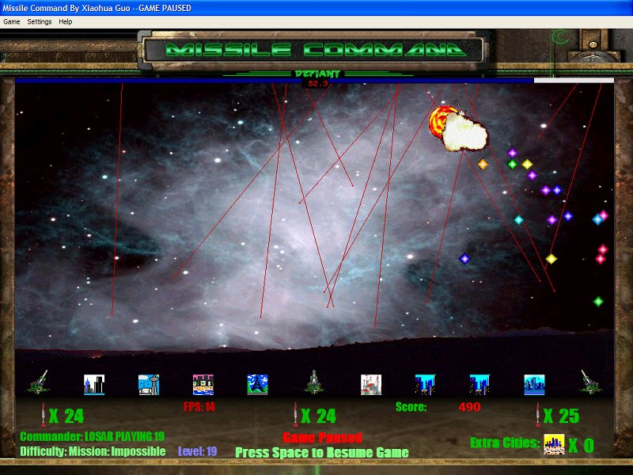



## Missile command \*Final 2, no bugs\*

### Description

Missile Command Game (no more bugs version, seriously), give it a shot, you might like it, it’s for ALL windows versions. Cursor and resolution changes back to original. This game is the remake of the original but with lots of improvements.. it's pretty fun. it has sound, full colour animation, 1024x768 res, and music (separate download). lots of improvements on earlier versions. Visit www.geocities.com/defiant_xg for the music. i suggest you get the music, the game is really bland without it.
 
### More Info
 

             |
---                |---
**Submitted On**   |2002-03-16 17:45:06
**By**             |[Xiaohua Guo](https://github.com/Planet-Source-Code/PSCIndex/blob/master/ByAuthor/xiaohua-guo.md)
**Level**          |Intermediate
**User Rating**    |4.8 (24 globes from 5 users)
**Compatibility**  |VB 5\.0, VB 6\.0
**Category**       |[Games](https://github.com/Planet-Source-Code/PSCIndex/blob/master/ByCategory/games__1-38.md)
**World**          |[Visual Basic](https://github.com/Planet-Source-Code/PSCIndex/blob/master/ByWorld/visual-basic.md)
**Archive File**   |[Missile\_co634003192002\.zip](https://github.com/Planet-Source-Code/xiaohua-guo-missile-command-final-2-no-bugs__1-32829/archive/master.zip)

